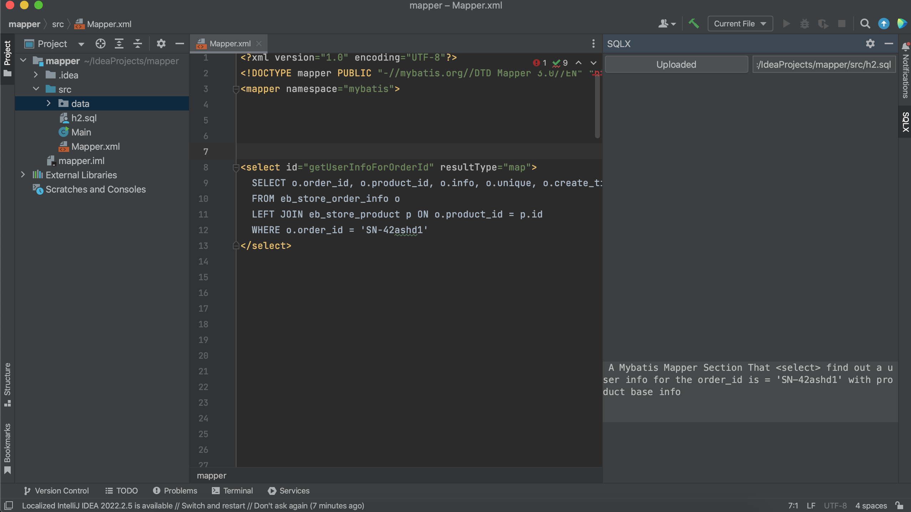

# SQL X
Help you write complex SQL faster.   Power by AI 

## Quickstart

Step 1: Save your Database Table Creation Statements file when you this plugin downloaded first time.   
Step 2: Once your table structure saved, Ask it anything to create SQLs base on your own tables.   
Like:  
    `find users that order price larger than 500 last 3 days`   

Press "Enter" key then wait for SQL inject to your current cursor position.  

## Capture

## Install 
1.[distributions](build%2Fdistributions) 
built the latest package, you download this package then "Install Plugin from Disk"  

2.Or Search in Marketplace "SQLX"

